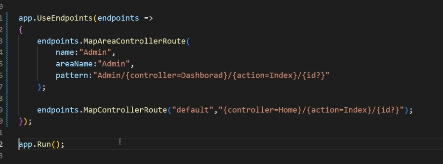

`<form method="post" asp-action="Apply">` => `asp-action` ile aynı controller içindeki action kısmına bağladık.  
`<label asp-for="Email"></label>` => `asp-for` kullanımı ile ne için olacağını söylersin bu sayede label içlerini otomatik doldurtabilirsini. 
` <a class="btn btn-success" asp-controller="Home" asp-action="Index"> Home</a>` => kullanımı ile farklı yola gidebilirsin 
`[ValidateAntiForgeryToken]    [FromForm]` => kullanımları ile formdan veri alınımı daha güvenli hale gelmekte 
`dotnet ef migrations add init` => db ayarlar. `outputdir`  `context`   `project` gibi gibi özelleştirme vardır.  
`dotnet ef database update` => migrationsları veritabanına uygular 
`OnModelCreating` => bunun içinde veri doldurması yaparken base komutu sonrası koy kalan methodlarda sonra koy riske girme öncesinde olunca veri doldurma çalışömadı 
`view sayfa başına Layout = null` => ifadesi ile genel kullanılan null ifadesini iptal edebilirsin  
`` =>  
`` =>  
`` =>  
`` =>  
`` =>  
`` =>  
`` =>  
`` =>  
`` =>  
`` =>  
`` =>  
`` =>  
`` =>  
`` =>  
`` =>  
`` =>  
`` =>  
`` =>  
`` =>  
`` =>  
`` =>  
`` =>  
`` =>  
`` =>  
`` =>  
`` =>  
`` =>  
`` =>  
`` =>  
`` =>  
`` =>  
`` =>  
`` =>  
`` =>  
`` =>  
`` =>  
`` =>  
`` =>  
`` =>  

### ViewComponent

`Components` klasörğ açılır ve `ViewComponent` miras alınır. 

galiba ekrana yansıtılan bilgiler üzerinde işlemler yapmayı sağlayan yapı gibi örnek sepette 2 ürün var gibi simgeleri hesaplayıp veren yapı

 

otomatik yapı alıcı düzen

 

buradaki parçları sağlayan yapıalrmış bende farklı yazdım üstte mantık örneği olarakmış btk akedemi mvc dersi 8. bölüm gerekirse bakarım

 

### Areas

### Extensions

oto migrate

 
 

### tag helper

attribute yönetimi sağlar. burada tüm table özelliklerine bootstrap table özelliği ekler
 

